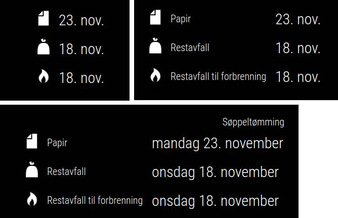

# MMM-AvfallshentingOslo

This is a module for [MagicMirror²](https://magicmirror.builders/) to show the next waste pickup dates for any address in Oslo, Norway. It gets the dates by scraping the [municipal lookup service](https://www.oslo.kommune.no/avfall-og-gjenvinning/avfallshenting/). All of the information on the board can be configured, ensuring you can get the exact look you want.

## Installation

Enter your MagicMirror² module folder, e.g.:

    cd ~/MagicMirror/modules

Clone the repository

    git clone https://github.com/blixhavn/MMM-AvfallshentingOslo.git

Add the module to your configuration file, for instance:

    {
        module: "MMM-AvfallshentingOslo",
        position: "top_right",
        config: {
            address: "Maridalsveien 52",
            dateFormat: "dddd Do MMM",
            showHeader: false,
            updateSpeed: 1000,
            refresh: 3600,
            displayIcons: true,
            displayWasteType: false,
            exclusions: ["Restavfall", "Restavfall til forbrenning"],

        }
    },

## Configuration options

| Configuration option | Comment                                                                                                                                                                                                    | Default                       |
| -------------------- | ---------------------------------------------------------------------------------------------------------------------------------------------------------------------------------------------------------- | ----------------------------- |
| address       | Street address to provide to the lookup service. Typically your home address.                                                                                   | "Slottsplassen 1"                         |
| dateFormat     | String specifying the date format for the Moment.js library. [See documentation here](https://momentjscom.readthedocs.io/en/latest/moment/04-displaying/01-format/).                                                  | "dddd Do MMMM" |
| showHeader     | Boolean for whether or not to display header for the module (see example in image above) | false                            |
| updateSpeed                 | Transition speed when updating the display.                                                                                                                                                                                 | 1000                      |
| refresh        | Refresh interval for polling the website for new information.                                                                                                                      | 3600                             |
| displayIcons          | Boolean for whether or not to display waste icons. Uses the [official waste icons](https://sortere.no/avfallssymboler) for Norway.                                                                                                                          | true                             |
| displayWasteType          | Boolean for whether or not to display waste type text.                                                                                                             | false                             |
| exclusions          | List for waste types to exclude from the list. Needs to match the exact text, but is case insensitive.                                                                                                            | []                             |

## Feedback and contributions
If you have any feedback , questions or suggestions, do not hesitate to make an issue on GitHub 🙂 Also, feel free to make contributions in form of pull requests!

## License 
MMM-AvfallshentingOslo is released under the MIT license. Have at it.

-----
Made by Øystein Blixhavn